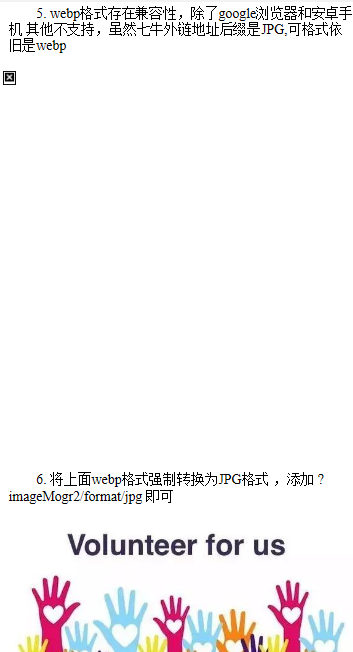
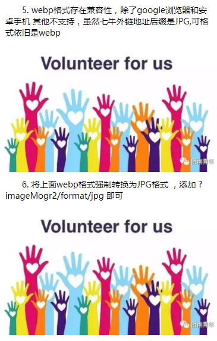

# qiniuclouds
### 使用七牛外链图片注意事项 更多详见index.html
- 七牛获取的图片地址，不带后缀jpg或png的图片，或者地址中带有localhost等字样的地址，在安卓微信浏览器不能正常显示，苹果则可以
- 小米自带浏览器会将第如下图片拦截 默认是广告链接 其他浏览器不会   如 ：
  (http://or9dun107.bkt.clouddn.com/CTS_1503372316001_file.jpg)
- 配置了域名的外链，小米自带浏览器不会拦截   如 ：
  (http://blog.qiniu.com/wp-content/themes/vortex/images/architecture-pratice.jpg)
- 普通格式 JPG JPEG 等不存在兼容性，浏览器和移动端都能正常解析
- webp格式存在兼容性，除了google浏览器和安卓手机 其他不支持，虽然七牛外链地址后缀是JPG,可格式依旧是webp
- 将webp格式强制转换为JPG格式 ，添加 ?imageMogr2/format/jpg 即可
- 骑牛压缩图片 , 添加 ?imageMogr2/size-limit/10k! 可自行对比
- [点击查看更多API](https://developer.qiniu.com/dora/manual/1270/the-advanced-treatment-of-images-imagemogr2)

### webp格式兼容性问题

### 强制转换后

